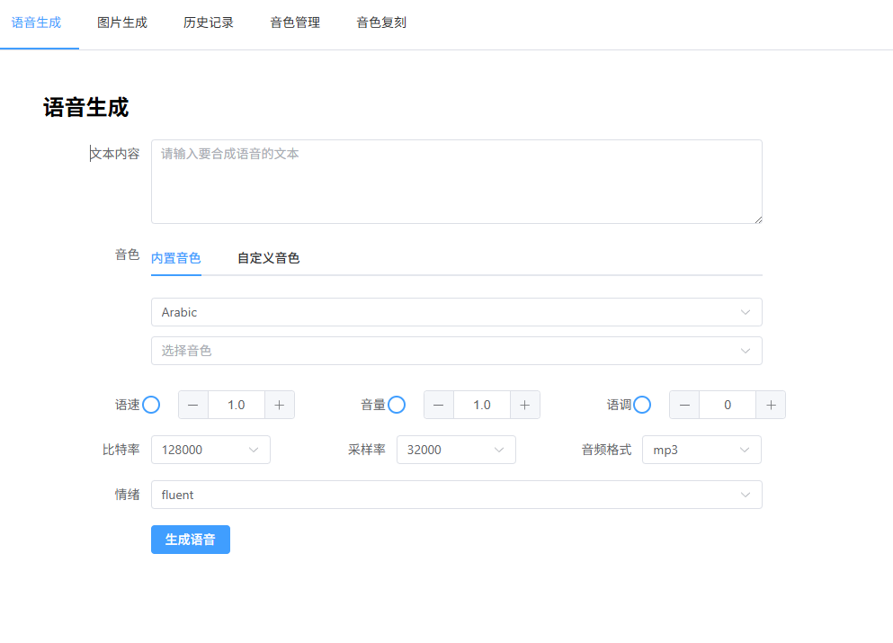
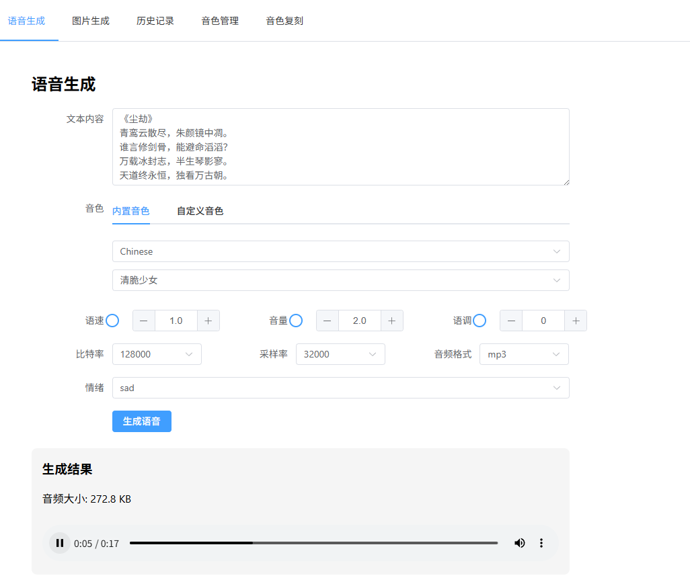
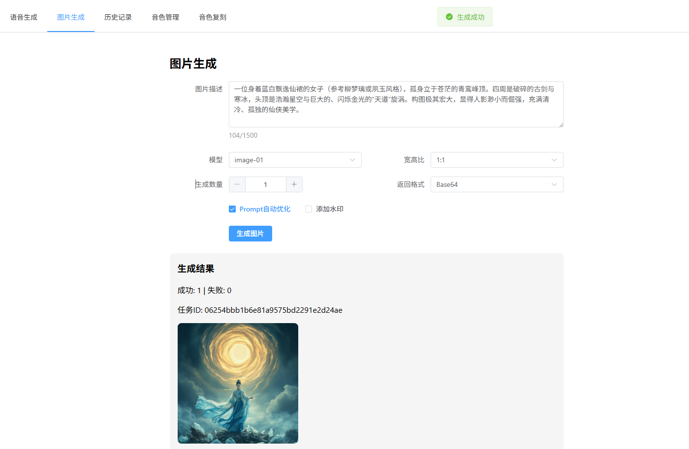
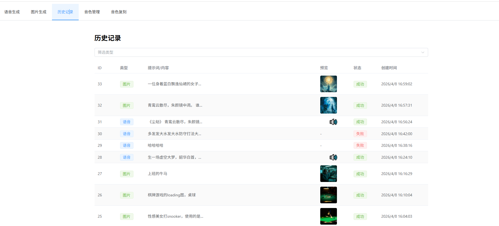
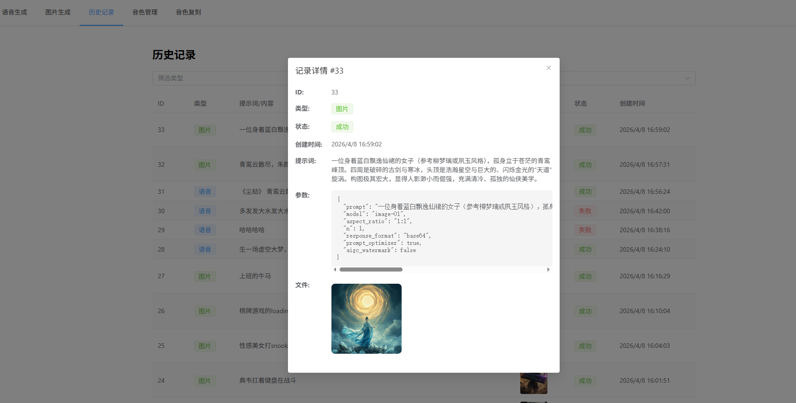
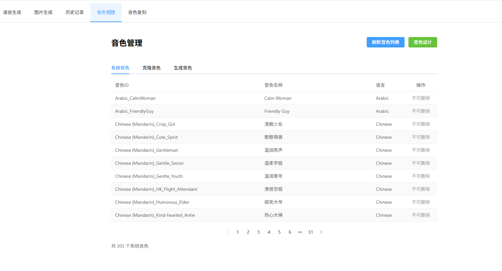
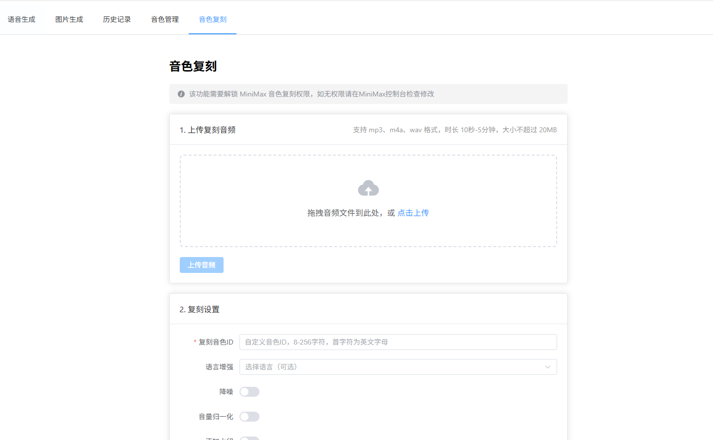
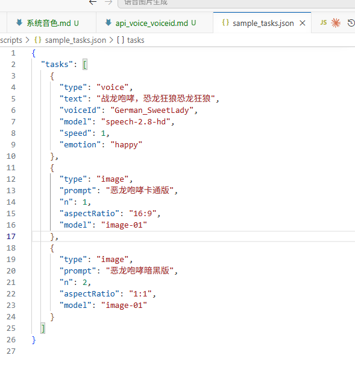

# 语音图片生成工具

基于 MiniMax API 的语音和图片生成管理平台。
测试地址：https://minimax.zergzerg.cn

## 功能特性

### 语音生成
- 支持多种音色选择（系统音色、克隆音色、生成音色）
- 可调节参数：比特率、采样率、音频格式、语速、音量、音调
- 支持情感控制（happy、sad、angry、calm 等）
- 支持语言增强（中文、英语、日语等 30+ 种语言）
- 生成历史自动记录

### 图片生成
- 支持多种模型（image-01、image-01-live）
- 支持多种画布比例（1:1、16:9、4:3 等）
- 支持多种风格（realness、hd、anime、illustration、3d）
- 图片预览和放大查看
- 生成历史自动记录

### 音色管理
- 刷新音色列表：从 API 同步音色到本地数据库
- 删除音色：支持克隆音色和生成音色的删除
- 三类音色分类展示

### 历史记录
- 语音和图片生成历史
- 支持按类型筛选
- 查看生成详情和错误信息

## 快速开始

### 1. 环境要求

- Node.js >= 18
- MySQL >= 8.0
- MiniMax API Key

### 2. 安装

```bash
# 克隆项目后，进入目录
cd 语音图片生成

# 安装所有依赖（后端 + 前端）
npm run install:all
```

### 3. 配置

在项目根目录创建 `.env` 文件：

```env
# MiniMax API
API_KEY=your_api_key_here

# 数据库配置
DB_HOST=localhost
DB_PORT=3306
DB_USER=root
DB_PASSWORD=your_password
DB_NAME=minimax

# 服务端口
PORT=3000
```

### 4. 启动服务

```bash
# 启动后端服务（端口 3000）
npm run dev

# 新开终端，启动前端（端口 5173）
cd client && npm run dev
```

### 5. 访问应用

打开浏览器访问 http://localhost:5173

## 基本使用

### 界面截图

**语音生成 - 选择音色和输入文本：**



**语音生成 - 生成完成：**



**图片生成：**



**图片查看 - 放大：**


**历史生成记录：**



**历史生成记录详情：**



**音色管理：**



**音色复刻：**



**命令行批量生成：**



---

### 语音生成

1. **选择音色**：在音色列表中选择系统音色、克隆音色或生成音色
2. **输入文本**：在文本框输入要转换的文本内容
3. **调整参数**（可选）：
   - 比特率：64000~320000
   - 采样率：16000~48000
   - 音频格式：mp3/wav/flac
   - 语速：0.5~2.0
   - 音量：0~10
   - 音调：-12~12
   - 情感：happy/sad/angry/calm 等
   - 语言增强：选择对应语言
4. **点击生成**：等待语音生成完成

### 图片生成

1. **输入描述**：输入图片的文字描述（最多1500字符）
2. **选择模型**：image-01 或 image-01-live
3. **设置参数**（可选）：
   - 画布比例：1:1、16:9、4:3 等
   - 生成数量：1~9张
   - 风格（仅 image-01-live）：realness/hd/anime/illustration/3d
   - 提示词优化：开启/关闭
4. **点击生成**：等待图片生成完成

### 音色管理

1. **刷新音色**：点击刷新按钮从 MiniMax API 同步最新音色
2. **分类查看**：系统音色、克隆音色、生成音色分别展示
3. **删除音色**：对克隆音色和生成音色可进行删除

### 历史记录

1. **查看历史**：在历史页面查看所有生成记录
2. **类型筛选**：按语音/图片类型筛选
3. **查看详情**：点击记录查看生成参数和文件路径

## 批量生成脚本

项目支持命令行批量生成：

```bash
# 批量生成语音或图片
npm run batch
```

详细使用方式请参考 [批量生成脚本](doc/guide.md#批量生成脚本)

## 项目结构

```
├── server/                    # 后端服务
│   ├── index.js              # Express 入口
│   ├── routes/
│   │   ├── voice.js          # 语音相关 API
│   │   ├── image.js          # 图片相关 API
│   │   └── history.js        # 历史记录 API
│   ├── services/
│   │   ├── voiceService.js   # 语音生成服务
│   │   ├── imageService.js   # 图片生成服务
│   │   ├── voiceInventoryService.js  # 音色库管理
│   │   └── historyService.js # 历史记录服务
│   └── utils/
│       ├── logger.js         # 日志工具
│       └── db.js             # MySQL 数据库连接
├── client/                    # 前端 Vue3 应用
│   └── src/
│       ├── views/
│       │   ├── VoiceView.vue       # 语音生成页面
│       │   ├── ImageView.vue       # 图片生成页面
│       │   ├── HistoryView.vue     # 历史记录页面
│       │   └── VoiceManageView.vue # 音色管理页面
│       ├── api/
│       │   └── index.js      # API 接口封装
│       ├── router.js         # 路由配置
│       └── App.vue            # 根组件
├── scripts/
│   └── batchGenerate.js       # 批量生成脚本
├── doc/                       # 技术文档
│   ├── guide.md              # 使用指南
│   ├── api.md                # API 文档
│   └── architecture.md        # 架构文档
└── output/                    # 生成文件输出目录
    ├── voice/                 # 语音文件
    ├── image/                 # 图片文件
    └── uploads/               # 上传临时文件
```

## 数据库表

### generation_history - 生成历史表

| 字段 | 类型 | 说明 |
|------|------|------|
| id | INT | 主键 |
| type | ENUM('voice','image') | 生成类型 |
| prompt | TEXT | 提示词/文本内容 |
| params | JSON | 完整传参 JSON |
| file_path | VARCHAR(500) | 文件路径 |
| file_size | INT | 文件大小(字节) |
| status | ENUM('success','failed') | 状态 |
| error_msg | TEXT | 错误信息 |
| created_at | DATETIME | 创建时间 |

### voice_inventory - 音色库表

| 字段 | 类型 | 说明 |
|------|------|------|
| id | INT | 主键 |
| voice_id | VARCHAR(255) | 音色 ID |
| voice_name | VARCHAR(255) | 音色名称 |
| description | TEXT | 描述 |
| source | ENUM | 来源(system/voice_cloning/voice_generation) |
| created_time | VARCHAR(50) | 创建时间 |
| synced_at | DATETIME | 同步时间 |

## API 接口

### 语音

| 方法 | 路径 | 说明 |
|------|------|------|
| GET | /api/voice/options | 获取音色列表和参数选项 |
| POST | /api/voice/refresh | 刷新音色列表（从 API 同步到数据库） |
| POST | /api/voice/design | 音色设计 |
| POST | /api/voice/upload | 上传复刻音频 |
| POST | /api/voice/clone | 音色快速复刻 |
| DELETE | /api/voice/:voiceId | 删除音色 |
| POST | /api/voice | 生成语音 |

### 图片

| 方法 | 路径 | 说明 |
|------|------|------|
| GET | /api/image/options | 获取图片生成参数选项 |
| POST | /api/image | 生成图片 |

### 历史

| 方法 | 路径 | 说明 |
|------|------|------|
| GET | /api/history | 获取历史记录列表 |
| GET | /api/history/:id | 获取历史记录详情 |

## 技术栈

**后端**
- Express.js - Web 框架
- mysql2 - MySQL 驱动
- log4js - 日志管理
- axios - HTTP 客户端

**前端**
- Vue 3 - 渐进式框架
- Vue Router - 路由管理
- Element Plus - UI 组件库
- Axios - HTTP 客户端
- Vite - 构建工具

## 开发者小贴士

以下是一些基于开发者视角的小贴士，帮助您的项目更加稳健：

### 1. 鉴权与 API Key 的最佳实践

- **Key 的区分**：调用语音或图片生成能力时，务必使用以 `sk-api-` 开头的普通 API Key（按量计费）。`sk-cp-` 开头的 Coding Plan Key 目前仅支持文本模型。
- **安全提示**：请勿将 API Key 直接硬编码在客户端代码中，推荐通过环境变量或后端转发的方式进行保护。

### 2. 模型接口地址适配

- **语音合成 (TTS)**：推荐使用最新的 `/v1/t2a_v2` 接口，该接口在性能和参数支持上优于旧版。
- **图像生成**：目前支持文生图和图生图能力，可以参考 [MiniMax API 文档](https://api.minimaxi.com/) 进行调优。

### 3. 官方开发者资源支持

- **GitHub 仓库**：[MiniMax-AI](https://github.com/MiniMax-AI) 下有多个 MCP 的 Python 和 JS 实现参考
- **技术支持邮箱**：api@minimaxi.com
- **模型调试台**：[https://solutions.minimaxi.com/](https://solutions.minimaxi.com/)（可用于快速验证各种模态的效果）

## 技术文档

详细技术文档位于 `doc/` 目录：

- [使用指南](doc/guide.md) - 详细使用说明和批量生成脚本
- [API 文档](doc/api.md) - 完整的 API 接口文档
- [架构文档](doc/architecture.md) - 系统架构设计
