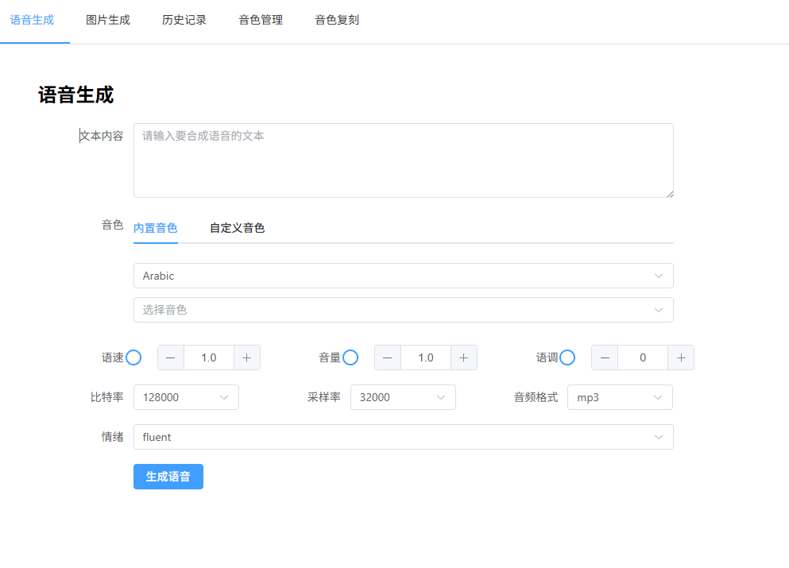
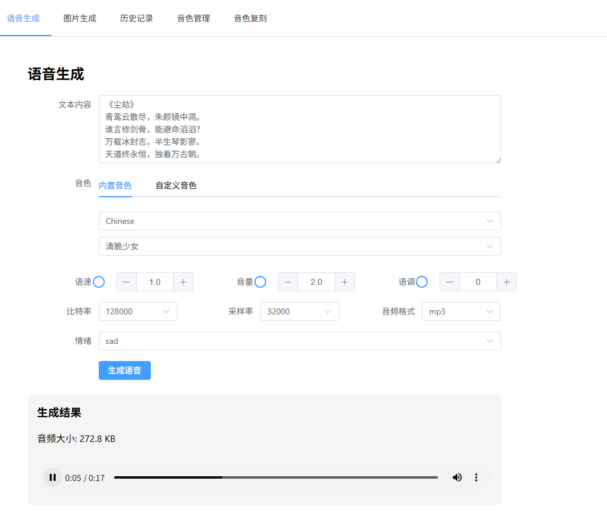
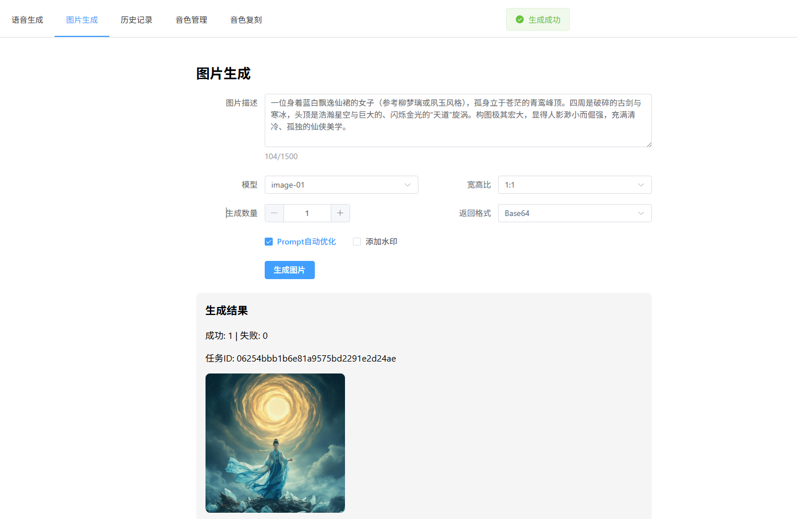
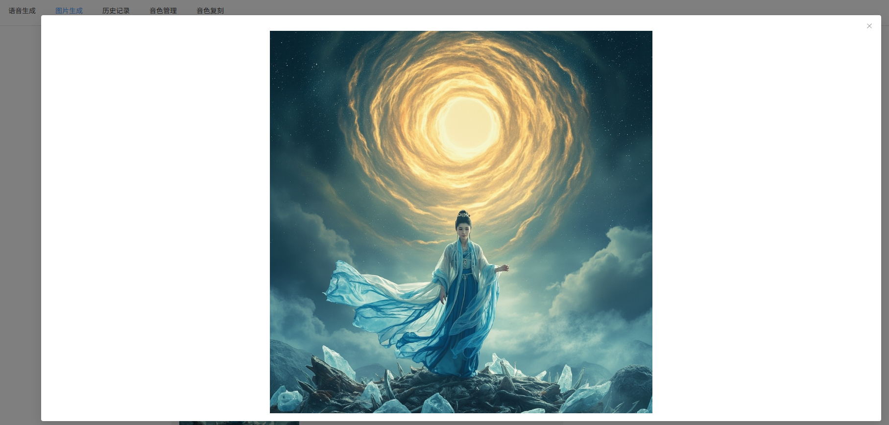
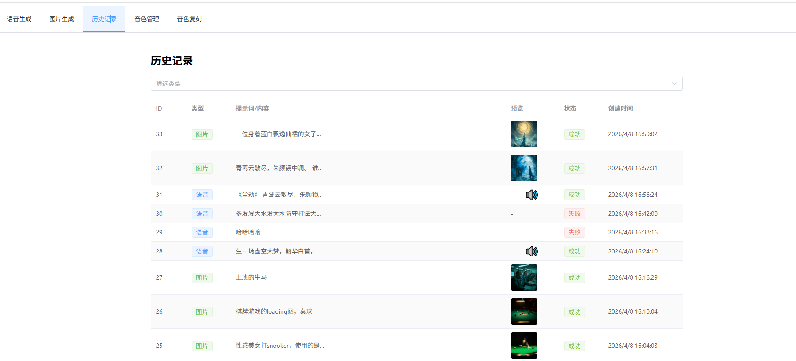
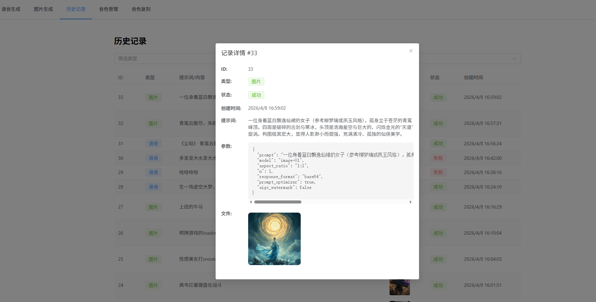
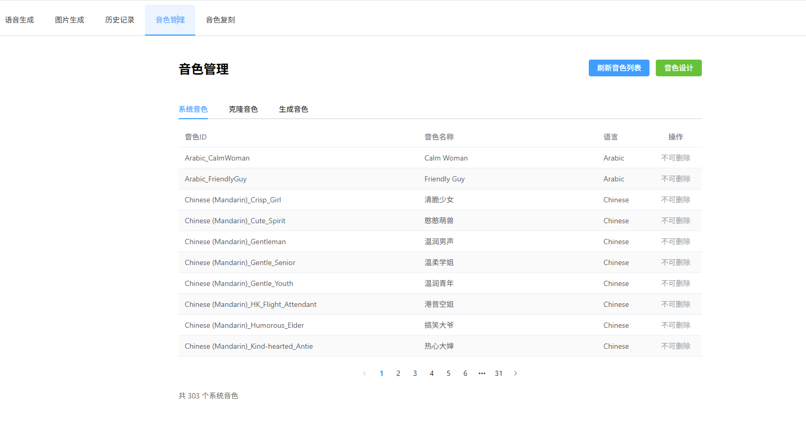
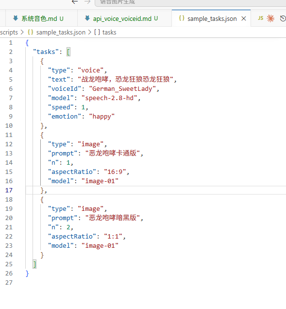

# 使用指南

## 目录

- [快速开始](#快速开始)
- [语音生成详解](#语音生成详解)
- [图片生成详解](#图片生成详解)
- [视频生成详解](#视频生成详解)
- [歌词生成详解](#歌词生成详解)
- [音乐生成详解](#音乐生成详解)
- [历史生成记录](#历史生成记录)
- [音色管理](#音色管理)
- [批量生成脚本](#批量生成脚本)

---

## 快速开始

### 环境要求

- Node.js >= 18
- MySQL >= 8.0
- MiniMax API Key（需开通语音/图片/音乐生成权限）

### 安装步骤

1. **安装依赖**

```bash
npm run install:all
```

2. **配置环境变量**

创建 `.env` 文件：

```env
API_KEY=your_api_key_here
DB_HOST=localhost
DB_PORT=3306
DB_USER=root
DB_PASSWORD=your_password
DB_NAME=minimax
PORT=3000
```

3. **启动服务**

```bash
# 后端服务
npm run dev

# 前端（另一个终端）
cd client && npm run dev
```

4. **访问应用**

打开 http://localhost:5173

---

## 语音生成详解

### 1. 选择音色

系统支持三类音色：

| 类型 | 说明 | 删除支持 |
|------|------|---------|
| 系统音色 | MiniMax 预置音色 | 否 |
| 克隆音色 | 通过音频复刻的音色 | 是 |
| 生成音色 | AI 生成的全新音色 | 是 |

**常用系统音色 ID：**

中文：
- `moss_audio_ce44fc67-7ce3-11f0-8de5-96e35d26fb85`
- `Chinese (Mandarin)_Lyrical_Voice`
- `Chinese (Mandarin)_HK_Flight_Attendant`

英文：
- `English_Graceful_Lady`
- `English_Insightful_Speaker`
- `English_radiant_girl`

日文：
- `Japanese_Whisper_Belle`

### 2. 文本输入

- 最大长度：10000 字符
- 段落切换：使用换行符
- 停顿控制：`<#x#>` 标记，x 为秒数（0.01~99.99）
- 语气词标签（仅 speech-2.8-hd/turbo）：
  - `(laughs)` `(chuckle)` `(coughs)` `(breath)` `(sighs)` 等

### 3. 参数配置

| 参数 | 默认值 | 取值范围 | 说明 |
|------|--------|---------|------|
| 比特率 | 128000 | 64000~320000 | 音频质量 |
| 采样率 | 32000 | 16000~48000 | 音频采样率 |
| 音频格式 | mp3 | mp3/wav/flac | 输出格式 |
| 语速 | 1.0 | 0.5~2.0 | 语速倍率 |
| 音量 | 1.0 | 0~10 | 音量大小 |
| 音调 | 0 | -12~12 | 语调调整 |

### 4. 情感控制

可选情感：happy、sad、angry、fearful、disgusted、surprised、calm、fluent、whisper

> 注意：whisper 和 fluent 仅对 speech-2.6-turbo/hd 模型生效

### 5. 语言增强

支持 30+ 种语言增强，包括：
- 中文、英语、日语、韩语
- 阿拉伯语、俄语、西班牙语、法语
- 德语、葡萄牙语、土耳其语、荷兰语
- 越南语、印尼语、泰语、波兰语
- 等等...

### 界面示意

**语音生成 - 选择音色和输入文本：**



**语音生成 - 生成完成：**



---

## 图片生成详解

### 1. 选择模型

| 模型 | 说明 | 风格支持 |
|------|------|---------|
| image-01 | 高质量基础模型 | 无 |
| image-01-live | 实时风格模型 | realness/hd/anime/illustration/3d |

### 2. 文本描述

- 最大长度：1500 字符
- 建议：详细描述场景、人物、风格、光线等

### 3. 参数配置

| 参数 | 默认值 | 取值范围 | 说明 |
|------|--------|---------|------|
| 画布比例 | 1:1 | 1:1/16:9/4:3/3:2/2:3/3:4/9:16/21:9 | 图片比例 |
| 生成数量 | 1 | 1~9 | 单次生成张数 |
| 宽度 | - | 512~2048 | 像素，必须是8的倍数 |
| 高度 | - | 512~2048 | 像素，必须是8的倍数 |
| 提示词优化 | false | true/false | 自动优化描述 |
| 水印 | false | true/false | 添加AIGC水印 |

### 4. 风格选项（仅 image-01-live）

- **realness**：写实风格
- **hd**：高清风格
- **anime**：动漫风格
- **illustration**：插画风格
- **3d**：3D渲染风格

### 界面示意

**图片生成：**



**图片查看 - 放大：**




## 视频生成详解

视频生成基于 MiniMax H3 多模态视频模型，支持 4 种生成模式：文生视频、图生视频（首帧/首尾帧）、多模态参考生视频、提示词增强。

### 1. 4 种生成模式

| 模式 | 场景 | ratio | 多媒体 |
|------|------|-------|--------|
| 文生视频 (t2va) | 仅文本描述 | 必填，**不能为 adaptive** | 无 |
| 图生视频-首帧 (i2va) | 文本 + 1 张首帧图 | adaptive（由图片决定） | image_url role=first_frame |
| 图生视频-首尾帧 (i2va) | 文本 + 首帧 + 尾帧图 | adaptive | 2 张 image_url |
| 多模态参考 (r2va) | 文本 + 参考图/视频/音频 | 可选，默认 adaptive | reference_image/video/audio |
| 提示词增强 | 输入 prompt 增强为结构化版本 | adaptive | 无（仅返回增强文本） |

> **互斥规则**：首帧/尾帧与参考素材不可混用。

### 2. 参数配置

| 参数 | 默认值 | 取值范围 | 说明 |
|------|--------|---------|------|
| 模型 | MiniMax-H3 | 固定 | 多模态视频模型 |
| 分辨率 | 2K | 768P / 2K | 输出视频分辨率 |
| 时长 | 5 | 4-15 秒 | 视频时长 |
| 宽高比 | 16:9（文生）/ adaptive（图生）/ adaptive（多模态） | adaptive / 21:9 / 16:9 / 4:3 / 1:1 / 3:4 / 9:16 | 宽高比 |
| 水印 | false | true/false | 添加 AIGC 水印 |

### 3. 上传文件大小与格式限制

- 图片 (image_url)：JPG / JPEG / PNG / WEBP / HEIC / HEIF，单文件 ≤ 30MB（路由层 20MB 限制，建议客户端 ≤ 20MB）
- 视频 (video_url，仅多模态参考)：MP4 / MOV，单文件 ≤ 50MB（路由层 20MB 限制，v1 仅服务于 r2va 场景）
- 音频 (audio_url，仅多模态参考)：WAV / MP3，单文件 ≤ 15MB（路由层 20MB 限制）
- 多模态参考：参考图 ≤ 9 个、参考视频 ≤ 3 个、参考音频 ≤ 3 个

### 4. 异步任务机制

视频生成采用异步任务模式：

1. 提交后立即返回 taskId（不阻塞客户端）
2. 前端每 3 秒轮询 `/api/video/status/:taskId`
3. 命中 succeeded 后服务端下载视频到 `output/video/`，返回可访问 URL
4. 命中 failed / cancelled 后停止轮询并提示用户
5. 整个过程耗时约 1-5 分钟（取决于分辨率与时长）

### 5. 任务取消

任务处于 queued 状态时可取消（不产生费用），running 状态必须等待完成。删除已 succeeded/failed 记录用于清理历史。

### 界面示意

**视频生成 - 文生视频 Tab：**


**视频生成 - 图生视频 Tab：**


**视频生成 - 多模态参考 Tab：**


**视频生成 - 提示词增强 Tab：**


### 参考 API 文档

完整的接口定义、请求/响应格式、错误码与示例请参考：

- [docs/video/README.md](../video/README.md) - 接口索引与通用概念
- [docs/video/generation.md](../video/generation.md) - 创建视频任务
- [docs/video/query.md](../video/query.md) - 查询任务状态
- [docs/video/list.md](../video/list.md) - 查询任务列表
- [docs/video/delete.md](../video/delete.md) - 取消或删除任务
- [docs/video/context-ir.md](../video/context-ir.md) - H3-Context-IR 提示词增强
- [docs/video/regeneration.md](../video/regeneration.md) - 视频再生成（768P → 2K）

---
---

## 歌词生成详解

### 1. 选择模式

| 模式 | 说明 |
|------|------|
| 完整歌曲 | 根据主题创作完整歌词 |
| 编辑/续写 | 对现有歌词进行修改或续写 |

### 2. 文本输入

- **歌曲主题**：描述歌曲主题、风格或情感（最多2000字符）
- **现有歌词**：编辑模式下需提供现有歌词（最多3500字符）
- **歌曲标题**：可选，指定歌曲标题

### 3. 歌词结构标签

支持的歌词结构标签：
`[Intro]` `[Verse]` `[Pre-Chorus]` `[Chorus]` `[Hook]` `[Drop]` `[Bridge]` `[Solo]` `[Build-up]` `[Instrumental]` `[Breakdown]` `[Break]` `[Interlude]` `[Outro]`

### 4. 使用歌词

生成歌词后，点击「使用此歌词生成音乐」可直接跳转音乐生成页面。

### 界面示意

**歌词生成：**


---

## 音乐生成详解

### 1. 选择模型

| 模型 | 说明 |
|------|------|
| music-2.6 | 最新高质量模型（推荐） |
| music-2.5+ | 高质量模型 |
| music-2.5 | 标准模型 |

### 2. 文本输入

- **音乐描述**：描述音乐风格、情绪和场景（最多2000字符）
- **歌词**：歌曲歌词（纯音乐除外），使用 `\n` 分隔每行（最多3500字符）

### 3. 参数配置

| 参数 | 默认值 | 说明 |
|------|--------|------|
| 模型 | music-2.6 | 生成模型 |
| 输出格式 | hex | 音频返回格式 |
| 纯音乐 | false | 是否生成无人声音乐 |
| 歌词优化 | false | 自动优化歌词 |
| 水印 | false | 添加AIGC水印 |

### 4. 纯音乐模式

开启纯音乐模式时不生成人声，适合背景音乐、氛围音乐等场景。

### 5. 生成机制

音乐生成采用异步任务机制：
1. 点击生成后立即返回任务ID
2. 后台异步执行生成（预计3-5分钟）
3. 前端每200ms轮询任务状态
4. 实时显示生成进度

### 界面示意

**音乐生成：**


---

## 历史生成记录

### 查看历史

在导航栏点击「历史记录」进入历史管理页面，可查看所有语音、图片、视频、歌词和音乐生成记录。

支持按类型筛选：
- 全部
- 语音
- 图片
- 视频
- 歌词
- 音乐



### 查看详情

点击任意记录可查看详细信息，包括生成参数、生成时间、文件路径等。



---

## 音色管理

### 界面示意

**音色管理 - 查看和刷新音色列表：**



### 刷新音色

点击「刷新音色」按钮，从 MiniMax API 同步最新音色到本地数据库。

### 音色设计

通过文字描述生成全新的AI音色：
1. 输入音色描述（prompt）
2. 输入试听文本
3. 点击生成

### 音色复刻

通过上传音频快速复刻音色：
1. 上传音频文件（支持 mp3/wav/m4a）
2. 设置音色ID和描述
3. 点击复刻

> 注意：该功能需要解锁 MiniMax 音色复刻权限，如无权限请在 MiniMax 控制台检查修改

**音色复刻界面：**


---

## 批量生成脚本

项目提供命令行批量生成功能。

### 使用方法

```bash
npm run batch
```

### 配置方式

编辑 `scripts/batchGenerate.js` 文件：

```javascript
// 批量生成配置
const BATCH_CONFIG = {
  // 生成类型：voice 或 image
  type: 'voice',

  // 任务列表
  tasks: [
    {
      text: '要转换的文本内容',
      voiceId: 'moss_audio_ce44fc67-7ce3-11f0-8de5-96e35d26fb85',
      model: 'speech-2.8-hd',
      bitrate: 128000,
      sampleRate: 32000,
      audioFormat: 'mp3',
      speed: 1.0,
      emotion: 'fluent'
    },
    {
      text: '第二段文本',
      voiceId: 'English_Graceful_Lady',
      // ... 其他参数
    }
  ]
};
```

### 图片批量生成配置

```javascript
const BATCH_CONFIG = {
  type: 'image',

  tasks: [
    {
      prompt: '一个穿着汉服的少女在樱花树下',
      model: 'image-01-live',
      aspectRatio: '16:9',
      n: 4,
      style: 'anime'
    },
    {
      prompt: '未来城市天际线，赛博朋克风格',
      model: 'image-01',
      aspectRatio: '21:9',
      n: 2
    }
  ]
};
```

### 执行日志

脚本执行后会输出：
- 任务进度（当前/总数）
- 生成耗时
- 生成结果（成功/失败）
- 文件保存路径

**命令行批量生成：**



---

## 常见问题

### Q: 数据库连接失败？

1. 确认 MySQL 服务已启动
2. 检查 `.env` 中的 DB_* 配置
3. 确认数据库已创建（`CREATE DATABASE minimax`）

### Q: API 调用失败？

1. 确认 `API_KEY` 正确
2. 检查 API 余额是否充足
3. 查看服务器日志 `logs/` 目录

### Q: 音频文件无法播放？

1. 确认使用了支持的格式（mp3/wav/flac）
2. 检查文件是否完整生成
3. 尝试更换音色或降低比特率

### Q: 图片生成失败？

1. 检查描述是否包含敏感词
2. 确认生成数量在 1-9 范围内
3. 验证宽高是否为 8 的倍数
